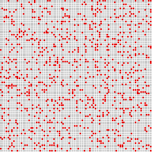

# Cell Automaton

Conway's Game of Life in Python, C++ (SFML), and C++ (Raylib 3D).

---

### Python



```bash
python3 graphics.py
```

---

### C++ / SFML


```bash
cd c++
./main
```

---

### C++ / Raylib 3D


```bash
cd c++
./3D
```
